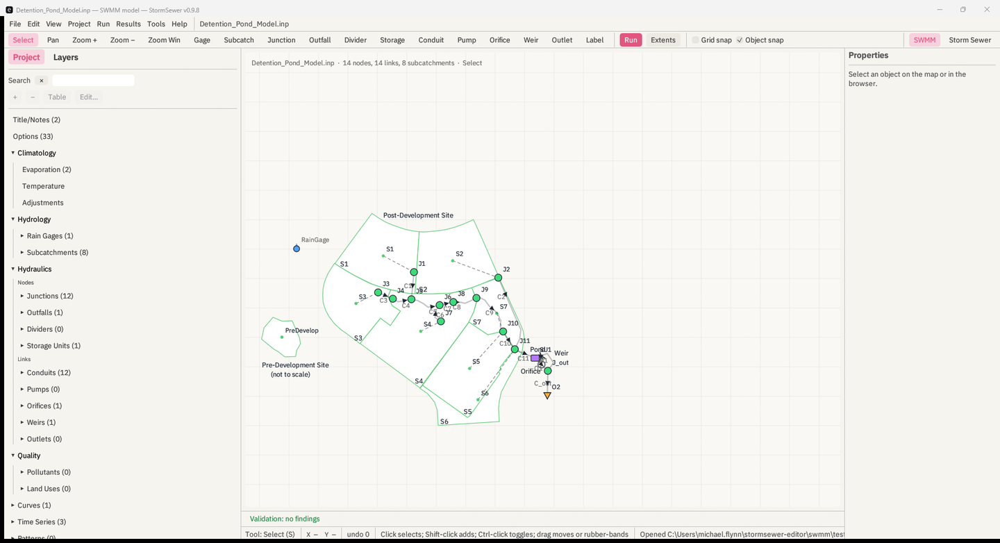

# StormSewer

**A free, GPL editor for EPA SWMM models, with a storm-sewer design tool
built in.** Windows, macOS and Linux. Built by a practicing
water-resources PE.



**[Download the latest release](https://github.com/mf4633/stormsewer/releases/latest)** —
Windows installer, macOS universal app, Linux AppImage.
**[Read the manual](https://mf4633.github.io/stormsewer/manual/)** —
start here, tutorials on the EPA sample models, one chapter per pane,
methods with equations and citations, troubleshooting, file formats, a
Python cookbook. The Markdown source is in [`docs/`](docs/index.md).

## What it is

StormSewer opens an EPA SWMM 5 `.inp`, draws it, lets you edit it on a map
and in a property sheet and attribute tables, runs it on the EPA engine you
already have installed, and puts the results back on the same map. The
storm-sewer design engine it started as — Rational method, Manning,
standard-step HGL backwater, HEC-22 inlets, catalog auto-sizing, submittal
schedules — is one tool inside that editor and can run on a SWMM model's
conduits, and it still runs on its own network in the storm-sewer
workspace.

**What it does.**

- Lossless `.inp` document: every comment, blank line, column ruler and
  unknown section survives a round trip byte for byte (checked against the
  EPA sample models on every commit); an edit rewrites only the row it
  touched. Undo and redo for every gesture, field, dialog, import and
  batch, 500 steps deep. Autosave and crash recovery.
- Map editing with the EPA GUI's symbols and tools; snapping; vertices;
  rubber-band selection; copy and paste with references remapped; a
  `[BACKDROP]` image georeferenced from a world file; conduit lengths
  recomputed from the map on request.
- Project browser, property sheet, one attribute table per section with
  sort, filter, in-place editing, replace-in-column and CSV round trip;
  dialogs for options, gages, curves, time series, patterns, controls,
  pollutants and land uses; a unit-switch wizard that converts what the
  engine will not; a design-storm builder (NRCS Type I/IA/II/III, NOAA
  Atlas 14 regional, alternating block, Chicago); rain and GHCN-Daily
  import.
- A pre-run QA pass (undefined references, duplicate names the engine
  folds by case, zero lengths, bad time steps, weir-only junctions, …); a
  Run Status window with continuity errors on colour thresholds, every
  diagnostic list in full, and every warning and error explained from an
  index of all 112 engine codes.
- Results on the map by any reported variable with a time slider and
  query; time-series and scatter plots; the report's summary tables as
  grids; a profile with the HGL and its maximum envelope; run-to-run and
  engine-to-engine comparison; a model report (HTML or PDF) that names the
  engine version and binary hash; CSV and GeoJSON export.
- A Python terminal with the model, results and report paths bound.

**What it does not do.** No 2D overland solver. No coordinate reference
systems — coordinates are the model's map units. No calibration pane. No
GIS layer import (GeoPackage, shapefile) yet. No LID, groundwater, snow or
water-quality dialogs — those sections are kept and listed but edited as
text. It does not modify or replace the SWMM engine, and it reads no other
product's project files.

**How engines run.** StormSewer contains no SWMM solver. It runs EPA's own
`runswmm` unmodified as a child process, so several versions can be
registered and chosen per run; every run is stamped with the engine's
reported version and the SHA-256 of its executable, and the model report
prints both. Success is decided by reading the `.rpt` (the engine exits 0
regardless). A dirty model, or one on a non-ASCII path, runs from a
scratch copy and the Run Status window says so.

**Credits.** EPA SWMM — engine, manuals and sample models — is public
domain, and StormSewer cites it rather than re-explaining it; the design
methods follow FHWA HEC-22 and NRCS NEH 630; the open-source projects it
interoperates with or learned from are listed in the manual's
[credits](docs/A5-credits.md).

**0.9.8 · GPL-3.0-or-later · free for the world.** Ships four ways: a desktop
app, a command-line tool, a browser (WebAssembly) app, and an embeddable
Rust/WASM engine library.

## Download & install

> **Working inside Open CAD Studio?** There is a separate
> [Storm Sewer plugin](https://github.com/mf4633/opencad-storm-sewer-plugin) that
> draws and analyses the network on the OCS drawing itself. Drawing, import,
> analysis and the profile are free there too; its
> [$29/year Pro tier](https://hydrocomplete.com/stormsewer) covers the HTML
> report, auto-sizing and multi-return-period table — all of which **this
> desktop app does for free**. Pay for the plugin only if staying inside your
> drawing is worth it to you; otherwise this app is the complete tool.


| You want… | How |
| --- | --- |
| **To try the engine — no install** | **https://mf4633.github.io/stormsewer/** runs the same Rust engine as WebAssembly: quick calculators and whole-network analysis from an `.ssn` file, entirely client-side. The drawing and profile views are desktop-only |
| **The desktop app** | From the [**Releases** page](https://github.com/mf4633/stormsewer/releases): **Windows** the `-setup.exe` installer, or `StormSewer-windows-x64.zip` (portable — unzip and run, no installer and no administrator); **macOS** `StormSewer-macos-universal.zip` (Apple Silicon + Intel); **Linux** `StormSewer-x86_64.AppImage` (self-contained — `chmod +x` and run) or `StormSewer-linux-x64.tar.gz` |
| **A package manager** | **macOS:** `brew tap mf4633/tap && brew install --cask mf4633/tap/stormsewer`. **Windows:** `winget install MichaelFlynn.StormSewer` (pending manifest review), or `scoop bucket add stormsewer https://github.com/mf4633/scoop-bucket && scoop install stormsewer` |
| **The command-line tool** | `brew install mf4633/tap/stormsewer-cli` (macOS + Linux), or from [Releases](https://github.com/mf4633/stormsewer/releases): `stormsewer-cli-windows-x64.zip` / `stormsewer-cli-linux-x64.tar.gz` / `stormsewer-cli-macos.tar.gz` — unpack and run `stormsewer-cli <network.ssn>` |
| **To build it yourself** (any OS) | Install [Rust](https://rustup.rs), then `git clone https://github.com/mf4633/stormsewer && cd stormsewer && cargo build --release`. Binaries land in `target/release/`: `StormSewer` (app) and `stormsewer-cli` |
| **The engine as a Rust crate** | [`cargo add stormsewer`](https://crates.io/crates/stormsewer) — [docs.rs](https://docs.rs/stormsewer) |
| **The engine from Python** | `pip install stormsewer` — Rational, Manning, HGL and whole-network analysis straight into pandas ([docs](python/README.md)) |

> The **web app**, **prebuilt downloads**, the **Homebrew tap**, and the
> **crate** are all live. Building from source works on any OS (see
> `DISTRIBUTION.md`).
>
> The Windows installer bundles a software OpenGL renderer (Mesa llvmpipe),
> so StormSewer starts on virtual desktops, remote sessions, and VMs that have
> no GPU driver at all; it is used only when no hardware backend works.
>
> Windows and macOS builds are **unsigned**, so SmartScreen and Gatekeeper warn
> on first run; on macOS, right-click the app and choose Open.
>
> StormSewer needs a graphics driver (Direct3D 12 or OpenGL 2.0+). Run
> `StormSewer --check-renderer` to find out whether a machine can run it — it
> starts, draws, exits, and reports which renderer worked. A Windows machine
> with **no display driver at all** cannot run it; use the browser build
> instead. See [ROADMAP.md](ROADMAP.md).

## Working with Civil 3D

Both directions go through files. There is nothing to install in Civil 3D.

**Bringing a network in.** Three ways, in order of how much survives:

| From | Carries |
|---|---|
| Hydraflow Storm Sewers `.stm` | Everything: pipes, structures, per-line inverts, drainage areas, C, inlet times, grates, the IDF curves, the starting HGL, junction K |
| Civil 3D LandXML pipe network export | Geometry: pipes, structures, rims, per-pipe inverts. No hydrology; Civil 3D does not store it |
| DXF | Geometry, or a site plan to draw on as an underlay |

The `.stm` route is the one worth knowing about. Autodesk still ships the
Hydraflow Storm Sewers Extension, so the files are not orphaned, but it is a
separate Windows-only program: Civil 3D itself will not open a `.stm`, and
nothing in the box turns one into a pipe network in the drawing. This program
reads both the standalone Hydraflow format and the "Storm Sewers for AutoCAD
Civil 3D" one, on any of the three platforms, and writes the LandXML that does
put it in the drawing.

**Sending a network back.** Export LandXML, then in Civil 3D use Insert tab →
Import → LandXML. The file is written in the shape Civil 3D's own export uses,
including the `pipeNetType` that decides which parts list it draws from, and a
test holds it to that shape.

Round-tripping a network out and back in reproduces the same report byte for
byte, which is checked on every commit.

**What does not travel.** LandXML has nowhere to put drainage areas, runoff
coefficients, inlet times or an IDF curve. Those live in the `.ssproj` file
here. Keep the hydrology on this side and let the drawing hold the geometry.

## Methods

- **Rational method** peak-flow accumulation (`Q = C·i·A`) down a dendritic pipe network.
- **Manning** open-channel / partial-flow hydraulics for circular, box,
  elliptical, and arch conduits — exact geometry (no table lookups): normal
  depth, critical depth, full-flow and maximum capacity, velocity.
- **Time of concentration** — Kirpich, NRCS TR-55 sheet flow, FAA; travel time
  accumulated pipe-by-pipe.
- **HGL backwater** — true standard-step gradually-varied-flow profile with
  flow-regime classification (sub/critical/supercritical/pressurized), junction
  losses (`H = K·V²/2g`), tailwater seeding, and surcharge / adverse-slope handling.
- **HEC-22 structure losses** — access-hole energy loss (relative size,
  deflection, plunging, benching), opt-in per project.
- **HEC-22 inlets** — grate, curb-opening, combination, and sag interception
  (Izzard gutter spread, frontal/side-flow efficiency, weir/orifice sag).
- **Standard-pipe sizing** — smallest catalog diameter meeting velocity and
  percent-full criteria (Hydraflow-style design checks).
- **Rainfall** — three-parameter IDF curves, multi–return-period sets, a
  frequency factor (Cf), and **NOAA Atlas 14 import** with automatic a/b/c fitting.
- **Reports** — a submittal-shaped PDF: title block on every page, ruled pipe /
  structure / inlet schedules, a scaled plan schematic, and a profile with real
  elevation and station axes, HGL/EGL, and stated vertical exaggeration. Choose
  the sections and the destination in the Report Options dialog.

### The numbers you still have to look up

StormSewer runs the methods; it does not invent their inputs. Every value below
is one the program asks you for and expects you to be able to defend, so here
are the tables:

| You need | Sheet |
| --- | --- |
| A runoff coefficient C for a land use, surface and slope | [Runoff coefficients (C)](https://pe-calc.com/cheat-sheets/runoff-coefficients.html) |
| Manning's n for a pipe material | [Manning's n](https://pe-calc.com/cheat-sheets/mannings-n.html) |
| To choose between Kirpich, TR-55 and FAA for Tc | [Tc methods compared](https://pe-calc.com/cheat-sheets/time-of-concentration-methods.html) |
| A junction or minor loss K for `H = K·V²/2g` | [Minor loss coefficients (K)](https://pe-calc.com/cheat-sheets/minor-loss-coefficients.html) |
| Velocity, slope, cover and percent-full limits to design against | [Storm sewer design criteria](https://pe-calc.com/cheat-sheets/storm-sewer-design-criteria.html) |
| Atlas 14 depths turned into IDF coefficients | [Design rainfall / Atlas 14](https://pe-calc.com/cheat-sheets/design-rainfall-atlas14.html) |

All on [pe-calc.com](https://pe-calc.com), free and no sign-up.

**Units: results are US customary** (feet, inches, acres, cfs, in/hr). The
desktop app can take SI inputs (Parameters → Units → SI: metres, hectares,
mm/hr, metric pipe sizes), but it converts them to US customary for the
analysis and reports the results that way. The web build and CLI are US
customary only. Full SI output is not there yet (see [ROADMAP.md](ROADMAP.md)).
The Python primitives take `si=True`.

Implementations are intentionally simple and standards-based
so they can be audited against hand calculations — and
[**VALIDATION.md**](VALIDATION.md) does exactly that, working every number on a
reference network by hand and matching the engine to six decimal places.

## Library usage

```rust
use stormsewer::{Network, Node, Pipe};

let net = Network {
    nodes: vec![
        Node::inlet("N1", 100.0, 105.0, 2.0, 0.7), // invert, rim, area (ac), C
        Node::inlet("N2", 99.0, 104.0, 3.0, 0.8),
        Node::outfall("OUT", 98.0, 103.0),
    ],
    pipes: vec![
        Pipe::new("P1", "N1", "N2", 100.0, 1.5, 0.013), // length, dia (ft), n
        Pipe::new("P2", "N2", "OUT", 100.0, 1.5, 0.013),
    ],
};

// Quick check at a constant intensity (i = 4 in/hr):
let results = net.analyze_rational(4.0).unwrap();

// Full analysis (Tc → IDF intensity → design Q → hydraulics → HGL):
// let analysis = net.analyze(&idf_curve, &AnalysisOptions::default()).unwrap();
```

See `src/lib.rs` for the full rustdoc, `src/network.rs` and `src/hydraulics.rs`
for the core, and `examples/sample.ssn` for an input file.

## CLI

A command-line binary is built from the `stormsewer-cli` bin target:

```bash
cargo run --bin stormsewer-cli -- examples/sample.ssn
```

## WASM / web

The engine runs in the browser via WebAssembly — the same validated code as the
CLI, no server. The `stormsewer-wasm` crate exposes `wasm-bindgen` functions
(`manning_full_flow_circular`, `rational_peak`, `normal_depth_circular`,
`critical_depth_circular`, `kirpich_tc`, `tr55_sheet_flow`, and `analyze_ssn`
which runs a full network analysis from `.ssn` text).

```bash
./wasm/build.sh              # builds wasm/pkg via cargo + wasm-bindgen
cd wasm && python3 -m http.server   # then open http://localhost:8000
```

`wasm/index.html` is the working playground (live calculators + full-network
analysis, all client-side). The PDF export (`printpdf`) is behind the default
`pdf` feature and excluded from the wasm build.

## Build & test

```bash
cargo build
cargo test        # 180+ tests: engine, I/O, GUI app, and validation suites
```

Requires stable Rust (edition 2021).

## Validation

Correctness is pinned to hand-derived reference values, not just ranges:

```bash
cargo test --test validation        # analytical checks (Manning, Rational, Tc, …)
cargo test --test worked_example    # full two-pipe network vs. hand calc
cargo test --test hgl_validation    # HGL backwater vs. hand calc
cargo run  --example worked_example # print the hand-vs-engine comparison table
```

See `WORKED_EXAMPLE.md` and `READINESS.md`.

## Repository layout

| Path            | Contents                                                        |
| --------------- | --------------------------------------------------------------- |
| `src/hydraulics.rs` | Circular open-channel hydraulics (Manning, normal/critical depth) |
| `src/network.rs`    | Network model, Rational accumulation, HGL backwater pass       |
| `src/hydrology/`    | Tc estimators, TR-55, IDF curves and sets                     |
| `src/design/`       | Pipe sizing, design criteria, HEC-22 inlets, review, cost      |
| `src/io/`           | DXF, LandXML, PDF, HTML, project and `.stm` import/export      |
| `app/`              | egui desktop application (plan view, editing, reports)         |
| `examples/`         | Sample inputs and a WASM playground                            |

## License

**GPL-3.0-or-later — free for the world.** Full text in [`LICENSE`](LICENSE);
SPDX headers in every source file. StormSewer is an open recreation of standard,
public-domain methods; see [`PROVENANCE.md`](PROVENANCE.md) for the sources each
method implements and the clean-room basis.

*Hydraflow and Autodesk are trademarks of Autodesk, Inc. StormSewer is an
independent project, not affiliated with or endorsed by Autodesk.*

## Support & commercial work

StormSewer is free and GPL, and stays that way.

- **Bugs & feature requests** — open a
  [GitHub issue](https://github.com/mf4633/stormsewer/issues); they're read.
- **Commercial support, custom implementations, priority features** — a
  DOT-specific report template, integration with your firm's workflow,
  training, or a feature your projects need: email
  [support@hydrocomplete.com](mailto:support@hydrocomplete.com?subject=StormSewer%20support).
  Built and maintained by a practicing water-resources PE.
- **Say thanks** — if StormSewer saved you a submittal cycle, you can
  [buy me a coffee](https://buy.stripe.com/14A3cudxo91z1qo0OHdAk00?client_reference_id=stormsewer-repo),
  or try the browser suite at [hydrocomplete.com](https://hydrocomplete.com).

## See also

- **[HydroComplete](https://hydrocomplete.com)** — the same hydrology and
  hydraulics in a browser, plus detention routing, water quality and BMP
  sizing. Nothing to install. [What else is open source](https://hydrocomplete.com/open-source).
- **[HydroComplete for Civil 3D](https://hydrocomplete.com/civil3d)** — a paid
  add-in that runs on the drawing's own pipe network objects, so nothing is
  re-typed and there is no second model to keep in sync. Worth saying plainly:
  the storm sewer hydraulics it does are the same ones **this app does for
  free**. Pay for it only if staying inside Civil 3D is what you need.
- **[pe-calc.com](https://pe-calc.com)** — the reference sheets above, and
  calculators for the rest of a civil practice.
