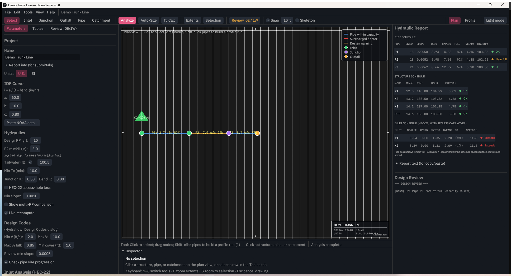

# StormSewer

**Free, open-source storm sewer design** — Rational method hydrology,
Manning hydraulics, HGL/EGL backwater, HEC-22 inlets with bypass
carryover, auto-sizing, and drawing-set schedules, on Windows, macOS,
and Linux. Built by a practicing water-resources PE.



**[Download the latest release](https://github.com/mf4633/stormsewer/releases/latest)** —
Windows installer, macOS universal app, Linux AppImage.

A free, open storm-sewer **design** tool — hydrology & hydraulics for gravity
pipe networks (Rational method, Manning, HGL backwater), an open recreation of
the standard, public-domain methods used by tools such as Autodesk Hydraflow
Storm Sewers.

**0.9.2 · GPL-3.0-or-later · free for the world.** Ships four ways: a desktop
app, a command-line tool, a browser (WebAssembly) app, and an embeddable
Rust/WASM engine library.

## Download & install

| You want… | How |
| --- | --- |
| **To try the engine — no install** | **https://mf4633.github.io/stormsewer/** runs the same Rust engine as WebAssembly: quick calculators and whole-network analysis from an `.ssn` file, entirely client-side. The drawing and profile views are desktop-only |
| **The desktop app** | From the [**Releases** page](https://github.com/mf4633/stormsewer/releases): **Windows** `StormSewer-0.9.2-setup.exe`; **macOS** `StormSewer-macos-universal.zip` (Apple Silicon + Intel); **Linux** `StormSewer-x86_64.AppImage` (self-contained — `chmod +x` and run) or `StormSewer-linux-x64.tar.gz` |
| **A package manager** | **macOS:** `brew tap mf4633/tap && brew install --cask mf4633/tap/stormsewer`. **Windows:** `winget install MichaelFlynn.StormSewer` (pending manifest review) |
| **The command-line tool** | `brew install mf4633/tap/stormsewer-cli` (macOS + Linux), or from [Releases](https://github.com/mf4633/stormsewer/releases): `stormsewer-cli-linux-x64.tar.gz` / `stormsewer-cli-macos.tar.gz` — unpack and run `stormsewer-cli <network.ssn>` |
| **To build it yourself** (any OS) | Install [Rust](https://rustup.rs), then `git clone https://github.com/mf4633/stormsewer && cd stormsewer && cargo build --release`. Binaries land in `target/release/`: `StormSewer` (app) and `stormsewer-cli` |
| **The engine as a Rust crate** | [`cargo add stormsewer`](https://crates.io/crates/stormsewer) — [docs.rs](https://docs.rs/stormsewer) |
| **The engine from Python** | `pip install stormsewer` — Rational, Manning, HGL and whole-network analysis straight into pandas ([docs](python/README.md)) |

> The **web app**, **prebuilt downloads**, the **Homebrew tap**, and the
> **crate** are all live. Building from source works on any OS (see
> `DISTRIBUTION.md`).
>
> Windows and macOS builds are **unsigned**, so SmartScreen and Gatekeeper warn
> on first run; on macOS, right-click the app and choose Open.

## Methods

- **Rational method** peak-flow accumulation (`Q = C·i·A`) down a dendritic pipe network.
- **Manning** open-channel / partial-flow hydraulics for circular, box,
  elliptical, and arch conduits — exact geometry (no table lookups): normal
  depth, critical depth, full-flow and maximum capacity, velocity.
- **Time of concentration** — Kirpich, NRCS TR-55 sheet flow, FAA; travel time
  accumulated pipe-by-pipe.
- **HGL backwater** — true standard-step gradually-varied-flow profile with
  flow-regime classification (sub/critical/supercritical/pressurized), junction
  losses (`H = K·V²/2g`), tailwater seeding, and surcharge / adverse-slope handling.
- **HEC-22 structure losses** — access-hole energy loss (relative size,
  deflection, plunging, benching), opt-in per project.
- **HEC-22 inlets** — grate, curb-opening, combination, and sag interception
  (Izzard gutter spread, frontal/side-flow efficiency, weir/orifice sag).
- **Standard-pipe sizing** — smallest catalog diameter meeting velocity and
  percent-full criteria (Hydraflow-style design checks).
- **Rainfall** — three-parameter IDF curves, multi–return-period sets, a
  frequency factor (Cf), and **NOAA Atlas 14 import** with automatic a/b/c fitting.
- **Reports** — a submittal-shaped PDF: title block on every page, ruled pipe /
  structure / inlet schedules, a scaled plan schematic, and a profile with real
  elevation and station axes, HGL/EGL, and stated vertical exaggeration. Choose
  the sections and the destination in the Report Options dialog.

All units are US customary (feet, seconds, cfs) unless a metric Manning/gravity
constant is passed. Implementations are intentionally simple and standards-based
so they can be audited against hand calculations — and
[**VALIDATION.md**](VALIDATION.md) does exactly that, working every number on a
reference network by hand and matching the engine to six decimal places.

## Library usage

```rust
use stormsewer::{Network, Node, Pipe};

let net = Network {
    nodes: vec![
        Node::inlet("N1", 100.0, 105.0, 2.0, 0.7), // invert, rim, area (ac), C
        Node::inlet("N2", 99.0, 104.0, 3.0, 0.8),
        Node::outfall("OUT", 98.0, 103.0),
    ],
    pipes: vec![
        Pipe::new("P1", "N1", "N2", 100.0, 1.5, 0.013), // length, dia (ft), n
        Pipe::new("P2", "N2", "OUT", 100.0, 1.5, 0.013),
    ],
};

// Quick check at a constant intensity (i = 4 in/hr):
let results = net.analyze_rational(4.0).unwrap();

// Full analysis (Tc → IDF intensity → design Q → hydraulics → HGL):
// let analysis = net.analyze(&idf_curve, &AnalysisOptions::default()).unwrap();
```

See `src/lib.rs` for the full rustdoc, `src/network.rs` and `src/hydraulics.rs`
for the core, and `examples/sample.ssn` for an input file.

## CLI

A command-line binary is built from the `stormsewer-cli` bin target:

```bash
cargo run --bin stormsewer-cli -- examples/sample.ssn
```

## WASM / web

The engine runs in the browser via WebAssembly — the same validated code as the
CLI, no server. The `stormsewer-wasm` crate exposes `wasm-bindgen` functions
(`manning_full_flow_circular`, `rational_peak`, `normal_depth_circular`,
`critical_depth_circular`, `kirpich_tc`, `tr55_sheet_flow`, and `analyze_ssn`
which runs a full network analysis from `.ssn` text).

```bash
./wasm/build.sh              # builds wasm/pkg via cargo + wasm-bindgen
cd wasm && python3 -m http.server   # then open http://localhost:8000
```

`wasm/index.html` is the working playground (live calculators + full-network
analysis, all client-side). The PDF export (`printpdf`) is behind the default
`pdf` feature and excluded from the wasm build.

## Build & test

```bash
cargo build
cargo test        # 180+ tests: engine, I/O, GUI app, and validation suites
```

Requires stable Rust (edition 2021).

## Validation

Correctness is pinned to hand-derived reference values, not just ranges:

```bash
cargo test --test validation        # analytical checks (Manning, Rational, Tc, …)
cargo test --test worked_example    # full two-pipe network vs. hand calc
cargo test --test hgl_validation    # HGL backwater vs. hand calc
cargo run  --example worked_example # print the hand-vs-engine comparison table
```

See `WORKED_EXAMPLE.md` and `READINESS.md`.

## Repository layout

| Path            | Contents                                                        |
| --------------- | --------------------------------------------------------------- |
| `src/hydraulics.rs` | Circular open-channel hydraulics (Manning, normal/critical depth) |
| `src/network.rs`    | Network model, Rational accumulation, HGL backwater pass       |
| `src/hydrology/`    | Tc estimators, TR-55, IDF curves and sets                     |
| `src/design/`       | Pipe sizing, design criteria, HEC-22 inlets, review, cost      |
| `src/io/`           | DXF, LandXML, PDF, HTML, project and `.stm` import/export      |
| `app/`              | egui desktop application (plan view, editing, reports)         |
| `examples/`         | Sample inputs and a WASM playground                            |

## Support

StormSewer is free and always will be. If it saves you time on a project and
you'd like to say thanks, you can [**buy me a coffee ☕**](https://buymeacoffee.com/mf4633).
Entirely optional — the tool stays fully featured and unrestricted either way.

## License

**GPL-3.0-or-later — free for the world.** Full text in [`LICENSE`](LICENSE);
SPDX headers in every source file. StormSewer is an open recreation of standard,
public-domain methods; see [`PROVENANCE.md`](PROVENANCE.md) for the sources each
method implements and the clean-room basis.

*Hydraflow and Autodesk are trademarks of Autodesk, Inc. StormSewer is an
independent project, not affiliated with or endorsed by Autodesk.*

## Support & commercial work

StormSewer is free and GPL, and stays that way.

- **Bugs & feature requests** — open a
  [GitHub issue](https://github.com/mf4633/stormsewer/issues); they're read.
- **Commercial support, custom implementations, priority features** — a
  DOT-specific report template, integration with your firm's workflow,
  training, or a feature your projects need: email
  [support@hydrocomplete.com](mailto:support@hydrocomplete.com?subject=StormSewer%20support).
  Built and maintained by a practicing water-resources PE.
- **Say thanks** — if StormSewer saved you a submittal cycle, you can
  [buy me a coffee](https://buy.stripe.com/14A3cudxo91z1qo0OHdAk00?client_reference_id=stormsewer-repo),
  or try the browser suite at [hydrocomplete.com](https://hydrocomplete.com).
