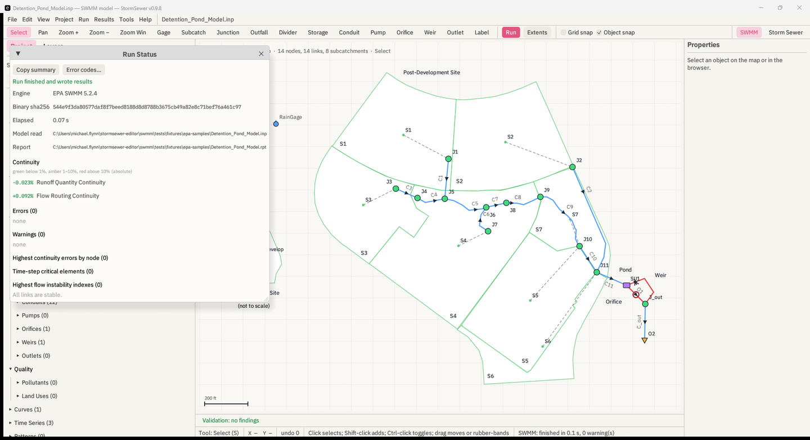

# 9. Run and engines

## 9.1 Engines

An engine is EPA's command-line runner, `runswmm.exe` on Windows or
`runswmm` elsewhere, found on disk as [§1.2](01-start-here.md) describes.
Each is identified by the version it reports to `--version` and by the
SHA-256 of the executable file, and both are stamped into every run. The Run
menu lists them as `EPA SWMM 5.2.4 — 32-bit (x86)`; the SWMM panel adds
`runs out-of-process` when the architecture differs from StormSewer's.

Several may be registered — 5.1.015 beside 5.2.4, or a 64-bit build you
compiled beside EPA's 32-bit one — and the chosen engine is the one `F5`
uses. **Find Engines** (Run menu and panel) rescans. The choice persists
for the session.

StormSewer never modifies an engine, links to it, or patches its results.
What EPA ships is what runs.

## 9.2 Running

**Run** (`F5`, the toolbar button, Run → Run, or **Run Model** in the
panel) does, in order:

1. Validates the document. Error-level findings refuse the run with *The
   model has errors*; the list is clickable ([§3.11](03-map-and-tools.md)).
   Warning-level findings show once, per document state, as *Warnings
   before running* — the same window as Run → Check Model… — with **Run
   anyway** and **Cancel**; once you have run anyway, the same warnings do
   not ask again until the model changes.
2. Decides which file to run. A saved, clean model on an ASCII path runs in
   place. Otherwise — unsaved, dirty, or a path with characters outside
   ASCII, which the stock engine may not open — a scratch copy of the
   current text is written under `%TEMP%\StormSewer\run\<hash>\`, with the
   model's `[FILES]` and data files carried along so their relative paths
   still resolve, and that copy runs. The report and results land beside
   whichever file ran, and the Run Status window says which (`Model read`,
   `Ran a scratch copy`).
3. Deletes any stale `.rpt` and `.out` beside it, because `runswmm` appends
   to an existing report and a run that dies without writing could otherwise
   be mistaken for a success.
4. Starts the engine on a worker thread with `inp rpt out` as arguments and
   waits. The window stays responsive; the toolbar shows a spinner and the
   panel says `running…`. Nothing else in the app runs in the background.
5. Reads the report. `runswmm` exits 0 whether the run worked or not, so
   the exit code is recorded for the log and ignored for the verdict. A run
   **succeeded** when the report has no `ERROR` line and a non-empty `.out`
   exists.
6. Reads the `.out` metadata (periods, step, object counts, flow units,
   start date) and computes the peaks for the map.
7. Copies the run into `%TEMP%\StormSewer\runs\<n>\` for Compare Runs; the
   last ten are kept.

**Stop** is in the Run menu but the engine runs to completion in this build
(`The engine runs to completion; it cannot be interrupted yet`).

The Run menu also holds **Check Model…** (the QA pass on demand — the
findings grouped as *Errors — the engine will refuse or misread the model*
and *Warnings — the model runs, but check these*, each clickable to select
the object) and **Autosave every N min** (0 = off; [§1.6](01-start-here.md)).

## 9.3 The SWMM panel

Under the Project/Layers tabs:

- **Engine** — the registered engines, the chosen one highlighted, or `No
  SWMM engine found.` in red; **Find Engines**.
- **Model** — the path of the model to run and **Choose Model (.inp)…**,
  which runs a file *without* opening it in the editor (a legacy path; the
  editor's open model is normally what runs).
- The view buttons **Map, Chart, Results, Profile, Plots, Tables** and
  **Fit Map**.
- **Time** — the reporting-period slider with **Play/Pause**, **Step**,
  **Show Peaks**, and the current frame's date and elapsed hours. This one
  slider drives the Results map, the Profile's HGL and the Chart cursor.
- **Run Model**.
- **Last run** — engine version and id, elapsed seconds, every `ERROR`
  (red) and `WARNING` (grey) line from the report, `worst continuity ±x.xxx%
  (section)`, and the failure reason if it failed; **Run ALR Checks** when
  the run succeeded.
- **Results** — `n periods every s s`, node and link counts with the flow
  units, the start date.
- **ALR** — the ALR verdict, when it has been run.
- The run log, monospace: the command line, stdout and stderr.

## 9.4 The Run Status window

When a run finishes, Results → Run Status… opens by itself with the whole
story of the run in one window:



- **Engine** — `EPA SWMM 5.2.4` and **Binary sha256**, the SHA-256 of the
  `runswmm` executable that produced this run; **Elapsed**; **Model
  read** — the path the engine read, with `Ran a scratch copy` when the
  model was dirty or on a non-ASCII path.
- **Result** — `Run finished and wrote results`, or `Run failed: …` with
  the first fatal line.
- **Continuity** — every continuity section's error, coloured green below
  1 %, amber from 1 to 10 %, red above 10 % (absolute). The thresholds are
  printed on the window. `No continuity section: the run did not get that
  far.` when the engine stopped in input.
- **Highest continuity errors by node**, **Highest flow instability
  indexes**, **Time-step critical elements**, **Most frequent
  non-converging nodes**, **Routing time step summary** — every entry the
  report carries (the engine's own text lists up to five per table; the
  window shows all it printed). Each entry that names a node or link is a
  button that selects and zooms to it.
- **Warnings** and **Errors** — every `WARNING nn` and `ERROR nnn` line,
  each with what the code means, the usual cause and the fix from the
  built-in index, and the object it names (if any) selected on click.
  **Error codes…** opens the index.
- **Copy summary** — a plain-text version for a note or an e-mail.

Help → SWMM Error Codes… lists the whole index — 112 codes from the EPA
SWMM 5.2 User's Manual, with causes and fixes drawn from what the forum
threads show people needed — with a **Search** box. [Appendix C](A3-error-codes.md).

## 9.5 Reading the report

The report (`.rpt`) is the only place the engine says whether the run was
any good. StormSewer parses:

- the banner (`EPA STORM WATER MANAGEMENT MODEL - VERSION 5.2 (Build
  5.2.4)`) for the version;
- every `ERROR nnn:` line (fatal) and `WARNING nn:` line;
- every `Continuity Error (%)` line with the section it sits in (`Runoff
  Quantity Continuity`, `Flow Routing Continuity`, `Quality Routing
  Continuity`, `Groundwater Continuity`);
- every summary table, by its asterisk-boxed title, into columns with the
  units line kept.

`worst continuity` is the largest absolute value across the sections. What
the number means and what to do about it is
[§16.1](16-troubleshooting.md).

## 9.6 ALR checks

Tools → ALR Checks (or **Run ALR Checks**) runs the ALR post-processor on a
finished run. ALR is a separate Python package that reads the `.out` and the
`.inp` beside it and evaluates conditions the engine's own report does not.
StormSewer finds it through `STORMSEWER_ALR_SCRIPT` (the path to
`run_headless_swmm.py`) and `STORMSEWER_ALR_PYTHON` (the interpreter, when
it is not `python`), runs `python run_headless_swmm.py <model.out> --json`,
and shows the verdict: a one-line summary and each failed check with its
node and message. Without those variables the item does nothing useful. The
`.inp` must be beside the `.out`, which a StormSewer run guarantees.

## 9.7 The command-line runner

The same engine registry, report parser and result reader are in
`stormsewer-swmm`, a command-line tool built with the app:

```
stormsewer-swmm engines
stormsewer-swmm run <model.inp> [--engine <id>] [--alr]
stormsewer-swmm info <model.out>
stormsewer-swmm series <model.out> (--node <name> | --link <name>) [--var <variable>]
stormsewer-swmm report <model.rpt>
stormsewer-swmm alr <model.out> [--nodes a,b] [--top N] [--all]
stormsewer-swmm inp <model.inp>
```

Unlike `runswmm`, it exits non-zero when a run fails, so it can drive a
batch. `inp` parses a model losslessly, proves the round trip, lists its
sections and prints the validator's findings. Node variables are `depth
head volume lateral-inflow total-inflow flooding`; link variables `flow
depth velocity volume capacity`.

## 9.8 What the runner does not do

- Batch or scenario runs: one model, one engine, one run at a time (Compare
  Engines runs two back to back). Batch from the CLI or the Python terminal
  ([chapter 18](18-python-cookbook.md)).
- Live results while the engine runs.
- Hotstart management: `[FILES]` lines are written as text in the Options
  dialog and the engine does the rest.
- Parallel engines: `THREADS` is an engine option and is passed through.
